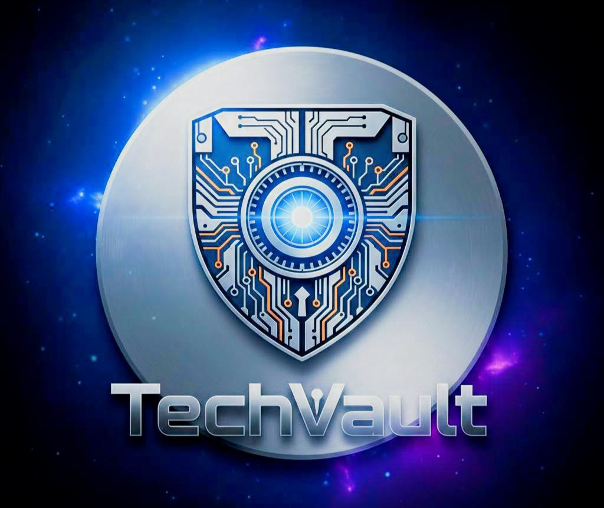

# 🚀 TechVault — AI-Enhanced Technical Resource Sharing Platform
<p align="center">
    
</p>
**TechVault** is a modern, scalable, AI-powered platform designed for developers to share and discover technical resources. Built using **Django**, **Django REST Framework**, and **PostgreSQL**, it integrates **Google Gemini AI** to provide automatic webpage summaries and an interactive **Ask-AI** feature for deep-diving into shared content.

---

## ✨ Key Features

### 🔐 User Management & Security
- **JWT Authentication**: Fully implemented Access and Refresh token system using **SimpleJWT**.
- **Secure Endpoints**: Protected routes using `IsAuthenticated` and `JWTAuthentication`.
- **Token Management**:
        - Login
        - Logout (with refresh token blacklisting)
        - Token refresh

---

### 📚 Resource Management
- **Technical Cataloging**: Add resources with title, URL, description, category, and tech stack.
- **Dynamic View Counting**: Automatically tracks resource popularity.
- **Tech Stack Analysis**: Grouping API to identify and count unique technologies across resources.

---

### 🤖 AI Integration (Google Gemini)
- **Automatic Summaries**:
        - Generates ~200-word summaries for shared URLs.
        - Powered by **Gemini 2.5 Flash**.
- **Interactive Ask-AI**:
        - Users can ask contextual questions about a resource.
        - Responses generated using **Gemini Pro**.
- **Smart Caching**:
        - AI responses stored in the database to avoid redundant API calls.

---

### 💬 Community Interaction
- **Nested Comments**:
        - Top-level comments with unlimited nested replies.
- **Voting System**:
        - Upvote/downvote resources.
        - Upvote/downvote individual comments.

---

## 🛠️ Tech Stack

| Layer     | Technology              |
|-----------|-------------------------|
| Backend   | Django 5.x              |
| API       | Django REST Framework   |
| Database  | PostgreSQL (Supabase)   |
| Auth      | JWT (SimpleJWT)         |
| AI/LLM    | Google Gemini API       |
| Caching   | Django LocMemCache      |

---

## 🚀 Getting Started

### ✅ Prerequisites
- Python 3.11+
- PostgreSQL Database
- Google Gemini API Key

---

## 📦 Installation

### 1. Clone the Repository
```bash
git clone https://github.com/aditya19prakash/techvault.git
cd techvault
```

### 2. Setup Virtual Environment
```bash
python -m venv venv
source venv/bin/activate
# For Windows:
# venv\Scripts\activate
```

### 3. Install Dependencies
```bash
pip install -r requirements.txt
```

### 4. 🔐 Environment Configuration
Create a `.env` file in the root directory:
```env
GEMINI_API_KEY=your_gemini_api_key_here
SECRET_KEY=your_django_secret_key_here
```

### 5. 🗄️ Database Setup & Migrations
```bash
python manage.py migrate
python manage.py createsuperuser
```

### 6. ▶️ Run the Server
```bash
python manage.py runserver
```

---

## 📡 API Endpoints Overview

### 🔑 User Authentication (`/user/`)
| Method | Endpoint       | Description                     |
|--------|----------------|---------------------------------|
| POST   | `login/`       | Generate Access & Refresh tokens |
| POST   | `logout/`      | Blacklist refresh token         |
| POST   | `refresh/`     | Generate new access token       |

### 📚 Resource Management (`/resources/`)
| Method | Endpoint            | Description                        |
|--------|---------------------|------------------------------------|
| GET    | `/`                 | List resources (paginated by views) |
| POST   | `/`                 | Create a new resource              |
| GET    | `<int:id>/`         | View details + AI summary          |
| POST   | `<int:id>/voting/`  | Vote for a resource                |
| GET    | `techstack/`        | Get grouped tech stack statistics  |

### 🤖 AI & Interaction (`/resources/<id>/`)
| Method | Endpoint            | Description                        |
|--------|---------------------|------------------------------------|
| POST   | `ask-ai/`           | Ask a question to Gemini AI        |
| GET    | `comments/`         | List top-level comments            |
| POST   | `comments/`         | Post a new comment                 |
| GET    | `comments/<int:cmt_id>/` | View nested replies            |

---

## 📂 Project Structure

```plaintext
techvault/
├── aiservice/    # Gemini AI integration, summaries, Ask-AI logic
├── comments/     # Nested comments and comment voting
├── resources/    # Resource catalog, tech stack tracking, views
├── users/        # JWT authentication and user profiles
├── votes/        # Voting models and serializers
├── techvault/    # Core settings and URL configuration
└── manage.py
```

---

## 📌 Notes
- Designed for scalability and clean API separation.
- AI calls optimized with database-level caching.
- Suitable for production-ready, resume-grade backend projects.

---

## 🌐 Postman Workspace
Explore the API endpoints using the [TechVault Postman Workspace](https://www.postman.com/avionics-administrator-93833485/workspace/techvault).

---

## 👤 Author
**Aditya Prakash**  
GitHub Repository: [TechVault](https://github.com/aditya19prakash/techvault)